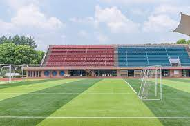
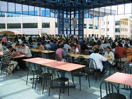

<!DOCTYPE html>
<html>
    <head>
        <meta name="viewport" content="with=device-width ,initial-scale=1.0";>
        <title>University WebPage</title>
        <link rel="stylesheet" href="style.css">
        <link rel="preconnect" href="https://fonts.googleapis.com">
<link rel="preconnect" href="https://fonts.gstatic.com" crossorigin>
<link href="https://fonts.googleapis.com/css2?family=Poppins:wght@100;200;300;400&display=swap" rel="stylesheet">
<link  rel="stylesheet" href="https://cdn.jsdelivr.net/npm/@fortawesome/fontawesome-free@6.1.1/css/fontawesome.min.css">
    </head>
    <body>
        <section class="header">
            <!-------Adding Logo-->
            <nav>
            
            <!-----Adding Navigation links-->
            

                <i class="fa fa-times" onclick="hideMenu()" ></i>
                <ul>
                    <li>HOME</li>
                    <li>ABOUT</li>
                    <li>COURSES</li>
                    <li>BLOG</li>
                    <li>CONTACT</li>
                </ul>
            

            <i class="fa fa-bars"></i>
        </nav>
            

                <h1>The world's Acknowleged University</h1>
                
Established in 2002.
                     It offers NBA and IEI accredited courses, state-of-the-art laboratories,
                      canteen facilities and infrastructure. It has a best-in-class Innovation and
                       Entrepreneurship Development Cell. It offers undergraduate, postgraduate and doctoral
                        programmes in multiple streams. The Institute is a venue of national and state level seminars
                         and symposiums and has emerged as the hub of technical education across the world.
                    For all who are seeking their purpose—in the classroom, the lab, the world— we weave together 
                    a tapestry of backgroundsand cultures, because we are made stronger by our diversity.

                <a href="" class="hero-btn">Visit us to Know More</a>
            

      
        </section>
<!--------------course offered--------------->
<section class="course">
    <h1>Courses We Offer</h1>
    
Our University offers exciting graduate courses all across the disciplines, with courses opening in new areas every year. 
        This includes taught courses and research courses available for full-time and part-time study, and at every level from
         diplomas to doctorates.Below you will find a list of subject areas offered for study at GSAS. Please note that some subject areas require you to apply to a particular degree program.

    

        

        <h3>Intermediate</h3>
        
MPC – Mathematics, Physics & Chemistry
            BiPC – Biology, Physics & Chemistry 
            CEC – Commerce, Economics & Civics
            CEG – Commerce, Economics & Geography
            HEC – History, Economics & Civics

        

        

            <h3>Degree</h3>
            
BBA- Bachelor of Business Administration
                BMS- Bachelor of Management Science
                BFA- Bachelor of Fine Arts
                BEM- Bachelor of Event Management
                Integrated Law Course- BA + LL.B
                BJMC- Bachelor of Journalism and Mass Communication
                BFD- Bachelor of Fashion Designing
                BSW- Bachelor of Social Work

            

            

                <h3>Post-Graduation</h3>
                
Master of Arts (MA) ...
                    Master of Science (MS, MSc) ...
                    Master of Research (MRes) ...
                    Master by Research (MPhil) ...
                    Master of Studies (MSt) ...
                    Master of Business Administration (MBA) ...
                    Master of Library Science (MLS, MLIS, MSLS) ...
                    Master of Public Administration (MPA)

                

    

</section>

<!------------------campus----------------->
<section class="campus">
    <h1>Our Global Campus</h1>
    
Our services are not limited over any particular place we got the campus over top 3 below locations in the world .Let's have a look on our global campus

    

        

            
            

                <h3>UNITED KINGDOM</h3>
            

            

            

                
                

                    <h3>UNITED STATES OF AMERICA</h3>
                

                

                

                    
                    

                        <h3>NEW ZEALAND</h3>
                    

                    

    

</section>
<!------------------Facilities----------------->
<section class="facilities">
    <h1>Our Facilities</h1>
    
We facilitates whaterever for the students for easing their studies.That enable them to work on so comfortably. 

    

        

            
            <h3>World Class Library</h3>
            
We have equipped a huge library which consists of lot of book resorces.This will cover all academic curriculam and apart from that also.We have stored 
                famous literatures and classic assets into it as separate section which gives students to spend their leisure on books in library.
            

        

        

            
            <h3>Largest Playground</h3>
            
The playground is part of many students' school day, and sometimes the learning environment on the playground can be just as important as that in the classroom. Studies have shown that playtime can provide not only physical benefits, but also emotional, social and cognitive benefits to students. During playtime, students can stay fit, learn self-control and compromise, enliven their imaginations, enhance independent thinking, develop self-confidence, and experience accomplishment by conquering physical challenges.

        

        

            
            <h3>Hygenic Canteen Facilities</h3>
            
The objective of the Canteen and meal service is to protect by reducing the risk of foodborne illness, with proper sanitary conditions, and preventing adulterated food. From the very beginning of the College in 2003, the College Canteen has been functioning efficiently. The canteen is located inside the College. The hostellers and day scholars are provided meals by assuring food safety and quality.

        

    

    </section>
    <!------------------Testimonials-------------->
    <section class="testimonials">
        <h1>What Our Student Says</h1>
    
iiiiiiiiiiiiiiiiiiiiiiiiiiiiiiiiiiiiiiiiiiiiiiiiiiiiiiiiiiiiiii

    

        

            
            

                
The infrastructure of the college is quite advanced and the laboratories and workshops 
                    are having modern equipments which are freely accessible to the students of the college

                <h3>Amaya Shaji</h3>
                <i class="fa fa-star"></i>
                <i class="fa fa-star"></i>
                <i class="fa fa-star"></i>
                <i class="fa fa-star"></i>
                <i class="fa fa-star-o"></i>
            

            

                
                

                    
 College has a dedicated training and placement department which prepares the students for placements.
                        The faculty members were good, and they used the best teaching methods to improve all types of students.
                    

                    <h3>David Mories</h3>
                    <i class="fa fa-star"></i>
                    <i class="fa fa-star"></i>
                    <i class="fa fa-star"></i>
                    <i class="fa fa-star"></i>
                    <i class="fa fa-star"></i>
                    
                

                

                
                

                    
The companies which come here for the recruitment are Infosys,
                         TCS, Indian Navy, MRF, IBM, Wipro, Think and Learn, EY, etc. 

                    <h3>John Abraham</h3>
                    <i class="fa fa-star"></i>
                    <i class="fa fa-star"></i>
                    <i class="fa fa-star"></i>
                    <i class="fa fa-star"></i>
                    <i class="fa fa-star-half-o"></i>
                

         

    

    </section>
    <!--------------entroll for/call to action-->
    <section class="cta">
        <h1>Entroll for our various online courses  Anywhere from the world</h1>
        <a href="" class="hero-btn">CONTACT US</a>

    </section>

    <!-----------------Footer-------------------------->
    <section class="footer">
        <h4>ABOUT US</h4>
        
Established in 2002. It offers NBA and IEI accredited courses, state-of-the-art laboratories,
             hostel facilities and infrastructure. It has a best-in-class Innovation and Entrepreneurship 
             Development Cell. It offers undergraduate, postgraduate and doctoral programmes in multiple streams 
             such as Engineering, Business & Management and IT & Software. The Institute is a venue of 
            national and state level seminars and symposiums and has emerged as the hub of technical education across the world.
        

    </section>

        
    </body>
</html>

        
        *{
    margin:0;
    padding:0;
    font-family: 'Poppins', sans-serif;
}
.header{
    min-height:100vh;
    width:100%;
    background-image:linear-gradient(rgba(4,9,30,0.7),rgba(4,9,30,0.7)),url(./vasily-koloda-8CqDvPuo_kI-unsplash.jpg);
    background-position:center;
    background-size:cover;
    position:relative;
}
nav{
display:flex;
padding:2% 6%;
justify-content:space-between;
align-items:center;
}
/* //----for logo-- */
nav img{
    width:150px;
}
/* for nav bars */
.nav-links{
flex:1;
text-align:right;
}
.nav-links ul li{
    list-style:none;/*no bullets */
    display:inline-block;/*to seen horizontally*/
    padding:8px 12px;
    position:relative;
}

.nav-links ul li /*a*/ {/*a href not working*/
    color:#fff;
    text-decoration:none;
    font-size:13px;
}
.nav-links ul li::after{
  content:'';
  width:0%;
  height:2px;
  background:#f44336;
  display:block;
  margin:auto;
  transition:0.5s;

}
.nav-links ul li:hover::after{
    width:100%;

}
.test-box{
    width:90%;
    color:#fff;
    position:absolute;
    top:50%;
    left:50%;
    transform:translate(-50%,-50%);
    text-align:center;
}
.test-box h1{
    font-size:62px;
}
.test-box p{
    margin:10px 0 40px;
    font-size:14px;
    color:#fff;
}
.hero-btn{
    display: inline-block;
    text-decoration:none;
    color:#fff;
    border:1px solid #fff;
    padding:12px 34px;
    font-size:13px;
    background:transparent;
    position:relative;
    cursor:pointer;
}
.hero-btn:hover{
    border:1px solid #f44336;
    background: #f44336;
    transition: 1s;
}
nav.fa{
    display:none;
}

@media(max-width:700px){
    .test-box h1{
        font-size:62px;
    }
    .nav-links ul li{
        display:block;
    }
    .nav-links {
        position:absolute;
        background:#f44336;
        height:100vh;
        width:200px;
        top:0;
        right:-200px;
        text-align:left;
        z-index:2;
        transition:1s;
    }
    nav.fa{
        display:block;
        color:#fff;
        margin:10px;
        font-size:22px;
        cursor:pointer;
    }
    .nav-links ul{
        padding:30px;

    }
}

/*-------------------------courses--------------*/
.course{
    width:80%;
    margin:auto;
    text-align:center;
    padding-top:100px;
}
h1{
    font-size:36px;
    font-weight:600;
}
p{
    color:#777;
    font-size:14px;
    font-weight:300;
    line-height:22px;
    padding:10px;
}
.row{
    margin-top:5%;
    display:flex;
    justify-content:space-between;
}
.course-col{
    flex-basis:31%;
    background: #fff3ff;
    border-radius: 10px;
    margin-bottom:5%;
    padding:20px 12px;
    box-sizing:border-box;
    transition:0.5s;

}
h3{
    text-align: center;
    font-weight:600;
    margin:10px 0;
}
.course-col hover{
    box-shadow:0 0 20px 0 rgba(0,0,0,0.2);

}
@media(max-width: 700px){
    .row{
    flex-direction:column;
}
}
/*----------campus-------------*/
.campus{
    width:80%;
    margin:auto;
    text-align:center;
    padding-top:50px;
}
.campus-col{
    flex-basis:32%;
    border-radius:10px;
    margin-bottom:30px;
    position:relative;
    overflow:hidden;

}
.campus-col img{
    width:100%;
    display:block;
}
.layer{
    background:transparent;
    height:100%;
    width:100%;
    position:absolute;
    top:0;
    left:0;
    transition:0.5s;
}
.layer:hover{
    background:rgba(226,0,0,0.7);

}
.layer h3{
    width:100%;
    font-weight:500;
    color:#fff;
    font-size:26px;
    bottom:0;
    left:50%;
    transform:translateX(-50%);
    position:absolute;
    opacity:0;
    transition:0.5s;
}

 .layer:hover h3{
    bottom:49%;
    opacity:1;/*inorder to come the text up*/
 }
 /*...........facilities..............*/
 .facilities{
  width:100%;
  margin:auto;
  text-align:center;
 padding:80px;
 }
 .facilities-col{

    flex-basis:31%;
    border-radius:10px;
    margin-bottom:5%;
    text-align:left;
 }
 .facilities-col img{
    width:100%;
    border-radius:10px;

 }
 .facilities-col p{
    padding:0;
 }
 .facilities-col h3{
    margin-top:16px;
    margin-bottom:15px;
    text-align:left;

 }
 .testimonials-col{
    flex-basis:44%;
    border-radius:10px;
    margin-bottom:5%;
    text-align:left;
    background:#fff3f3;
    padding:25px;
    cursor:pointer;
    display:flex;

 }
 .testimonials-col img{
    height:40px;
    margin-left:5px;
    margin-right:30px;
    border-radius:50%;

 }
 .testimonials-col p{
    padding:0;
 }
 .testimonials-col h3{
    margin-top:15px;
    text-align:left;
 }
 .testimonials-col fa{
    color:#f44336;
 }
 @media(max-width:700px){
    .testimonials-col img{
        
        margin-left:0px;
        margin-right:15px;
       
    
     }

 }
 /*-----------call to action--------*/
 .cta{
    margin:100px auto;
    width:80%;
    background-image:linear-gradient(rgba(0,0,0,0.7),rgba(0,0,0,0.7)),url(./study\ online.jfif);
    background-position:center;
    height:700px;
    width:100%;
    background-size:cover;
    border-radius:10px;
    text-align:center;
    padding:100px 0;
 }
 .cta h1{
    color:#fff;
    margin-bottom:70px;
    padding:0;
 }

 @media(max-width:700px){
    .cta h1{
       font-size:24 px; 
    }

 }
 .footer{
    width:100%;
    text-align:center;
    padding:30px 0;
 }
 .footer h4{
    margin-bottom:25px;
    margin-top:20px;
    font-weight:600;
 }
